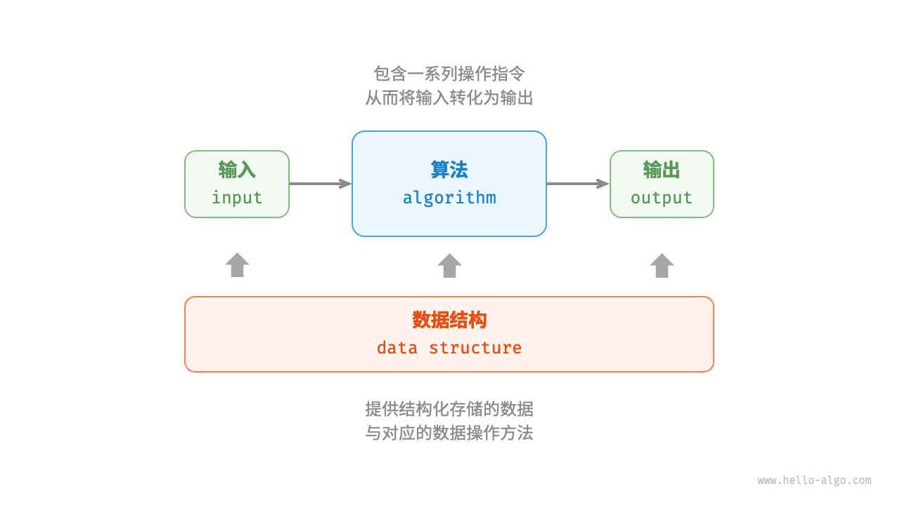

## 1.2 **算法是什么**

1. **算法定义**：算法是在有限时间内解决特定问题的一组指令或操作步骤。
   1. 具有问题明确（包含清晰输入输出定义）、
   2. 可行性（能在有限步骤、时间和内存空间下完成）、
   3. 确定性（各步骤含义确定，相同输入和运行条件下输出一致）的特性。
2. **数据结构定义**：数据结构是组织和存储数据的方式，涵盖数据内容、关系和操作方法。
   1. 其设计目标包括空间占用少、数据操作快速、提供简洁数据表示和逻辑信息以利于算法运行。
   2. 数据结构设计存在权衡，如链表与数组、图与链表在不同方面各有优劣。
3. **数据结构与算法的关系**：二者高度相关、紧密结合。

   1. 数据结构是算法的基石，为算法提供数据存储和操作方法；
   2. 算法为数据结构注入生命力，结合算法才能解决特定问题；
   3. 算法基于不同数据结构实现时效率不同，选择合适的数据结构很关键。
   4. 它们可类比为拼装积木，零件和说明书分别对应数据结构和算法。此外，数据结构与算法独立于编程语言，实际讨论中常将“数据结构与算法”简称为“算法”。

   

   | 数据结构和算法 | 拼装积木                                 |
   | -------------- | ---------------------------------------- |
   | 输入数据       | 原始积木                                 |
   | 数据结构       | 积木组织形式，包括形状、大小、连接方式等 |
   | 算法           | 把积木拼成目标形态的一系列操作步骤       |
   | 输出数据       | 积木模型                                 |
