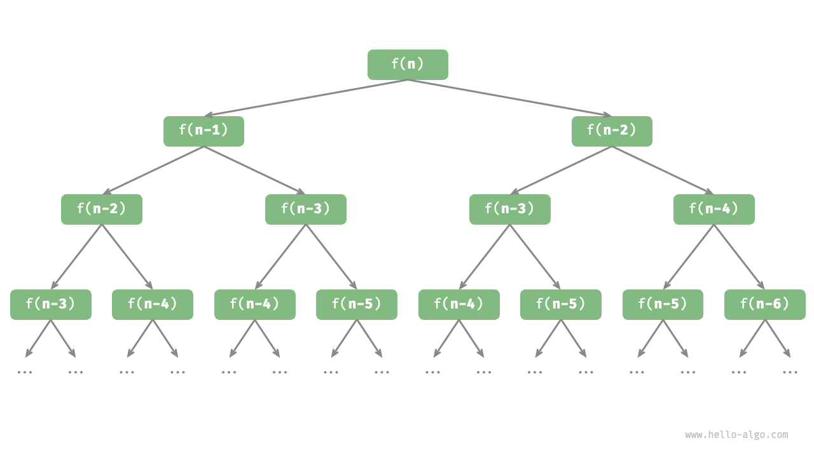

## 2.2 迭代与递归总结 📚

本章节主要介绍了在算法中实现重复任务的两种基本方式：**迭代** 🔁 和 **递归** 🔄。

---

### 迭代 🔁

- **概念**：
  迭代是一种重复执行某个任务的控制结构，通过循环结构重复代码，直到满足某个终止条件。
- **常见形式**：
  - **for 循环（更紧凑）**：
    - 用于当迭代次数已知时，如求和$1 + 2 +… + n$的例子。
    - 示例代码展示了如何利用 `for` 循环累加求和。
      ```cpp
      int forloop(int n){
      	int res=0;
      	for(int i = 1; i<=n; ++i){
      		res += i;
      	}
      	return res;
      }
      ```
      此求和函数的操作数量与输入数据大小$n$成正比，或者说成“线性关系”。实际上，**时间复杂度描述的就是这个“线性关系”**
  - **while 循环（更灵活）**：
    - 更加灵活，可以在每次循环前判断条件。
    - 示例中同样实现了求和，并展示了条件变量在循环内的更新方式。
      ```cpp
      int whileloop(int n){
      	int res = 0;
      	int i = 1;
      	while(i <= n){
      		res += i;
      		i++;
      	}
      	return res;
      }
      ```
    - 也介绍了在循环中更新变量多次（例如先加 1 再乘 2）的情况，此时 `while` 循环相比 `for` 循环更为适用。
  - **嵌套循环**：
    - 在一个循环中嵌套另一个循环（例如双层 `for` 循环），其时间复杂度通常为 $O(n^2)$
      ```cpp
      string nestedForloop(int n){
      	ostringstream res;
      	for (int i = 1; i <= n; ++i){
      		for (int j = 1; j <=n;++j){
      			res << "(" <<i<<","<<j<<"),";
      		}
      	}
      	return res.str();
      }
      ```
    - 随着嵌套层数的增加，时间复杂度会迅速上升到立方、四次方等。

---

### 递归 🔄

- **概念**：
  递归是通过函数调用自身来解决问题的策略，通常用于将大问题分解为更小的同类子问题。
  递归过程包含两个阶段：
  1. **递**：函数不断调用自身，将问题逐步简化；
  2. **归**：达到终止条件后，逐层返回并组合结果。
- **实现要素**：
  1. **终止条件**：决定何时停止递归（例如 $f(1) = 1$）。
  2. **递归调用**：函数在自身内部调用，传入更小规模的参数。
  3. **返回结果**：各层函数将结果传回上一层，直至最终获得答案。
  ```cpp
  int recur(int n){
  	if(n ==1){
  		return 1;}
  	else{
  		int res = recur(n-1)
  		return n + res;
  	}
  }
  ```
- **调用栈的影响**：
  - 每次递归调用都会分配栈帧，存储局部变量和调用信息，这可能导致较大的内存开销。
  - 由于函数调用本身的开销，递归的时间效率通常低于迭代。
- **尾递归**：
  - 当递归调用出现在函数的最后一步时，可被优化成迭代，从而减少内存占用，提升空间效率。
    ```cpp
    int tailrecur(int n,int res = 0){
    	if(n == 0){
    		return res;
    	}
    	else{
    		return tailrecur(n-1, res+n);
    	}
    }
    ```

---

### 递归树 🌳

- 当处理与“分治”相关的算法问题时，递归往往比迭代的思路更加直观、代码更加易读。
- 以斐波那契数列为例：
  - 数列的前两个数字为$f(1)=0和f(2)=1$。
  - 数列中的每个数字是前两个数字的和，即  $f(n)=f(n−1)+f(n−2)$。
  ```cpp
  int fib(int n){
  	if (n==2){
  		return 1;}
  	else if (n==1){
  		return 0;}
  	else {
  		return fib(n-1)+fib(n-2);}
  }
  ```
  

---

### 对比与应用 💡

- **迭代**：
  “自下而上”逐步构建结果，适用于操作简单且循环次数已知的场景，代码通常更为紧凑。
- **递归**：
  “自上而下”分解问题，代码更直观地反映问题的递归结构，但可能消耗更多内存和调用开销。
  选择哪种方式取决于具体问题的特点及对时间和空间效率的要求。

|          | 迭代                                   | 递归                                                         |
| -------- | -------------------------------------- | ------------------------------------------------------------ |
| 实现方式 | 循环结构                               | 函数调用自身                                                 |
| 时间效率 | 效率通常较高，无函数调用开销           | 每次函数调用都会产生开销                                     |
| 内存使用 | 通常使用固定大小的内存空间             | 累积函数调用可能使用大量的栈帧空间                           |
| 适用问题 | 适用于简单循环任务，代码直观、可读性好 | 适用于子问题分解，如树、图、分治、回溯等，代码结构简洁、清晰 |

总之，迭代和递归都是实现重复操作的有效工具，各有优缺点，理解它们的实现和复杂度分析有助于编写高效的算法。
