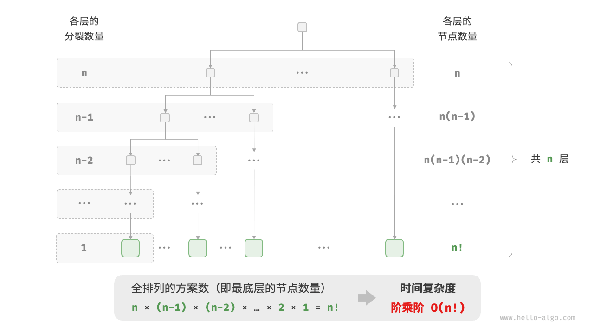

## 2.3 **时间复杂度 ⌛️**

---

### 📜 算法运行时间评估方法的演进

直接统计算法运行时间既不合理也不现实，因为：

- **平台差异**：算法需在不同硬件和软件环境中运行，执行时间各不相同。
- **操作时间不易获取**：计算每种操作的具体运行时间较难实现。

因此，引入**时间复杂度分析**，它衡量的是**算法运行时间随数据规模增大时的增长趋势**。

---

### 📌 时间复杂度的相关概念

### ⏳ 时间增长趋势

时间复杂度描述的是**输入规模**如何影响**算法执行时间**，例如：

- **算法 A（常数阶）**：运行时间**不随数据量变化**。
- **算法 B（线性阶）**：运行时间**随数据量线性增长**。
- **算法 C（对数阶）**：运行时间**增长较慢，随输入对数增长**。

```cpp
// 算法 A 的时间复杂度：常数阶
void algorithm_A(int n) {
    cout << 0 << endl;
}
// 算法 B 的时间复杂度：线性阶
void algorithm_B(int n) {
    for (int i = 0; i < n; i++) {
        cout << 0 << endl;
    }
}
// 算法 C 的时间复杂度：常数阶
void algorithm_C(int n) {
    for (int i = 0; i < 1000000; i++) {
        cout << 0 << endl;
    }
}
```

### 📈 函数渐近上界（Big-O 表示法）

时间复杂度分析的本质是计算**操作数量的渐近上界**，即算法最坏情况下的增长速率，使用**大 O 记号（Big-O）**表示：

- 计算**操作数量**。
- 确定其**渐近上界**，忽略低阶项和常数。

数学上，若 $f(n) = O(g(n))$ ，表示存在常数 $c, n_0$，使得 $f(n) \leq c \cdot g(n)$ 对所有 $n \geq n_0$ 成立。


---

### 📌 时间复杂度的推算方法

**时间复杂度计算一般分两步**：

1. **统计操作数量**：
   - 忽略**常数项**。
   - 省略**系数**（仅关注增长趋势）。
   - 处理**循环嵌套**时使用乘法法则。
2. **判断渐近上界**：
   - 复杂度由**最高阶项决定**，低阶项忽略。

例如：

- $3n^2 + 5n + 7 = O(n^2)$
- $10n + \log n = O(n)$

---

### 📌 常见时间复杂度类型

| **时间复杂度** | **表示法**   | **增长趋势**   |
| -------------- | ------------ | -------------- |
| **常数阶**     | $O(1)$       | 不随数据量变化 |
| **对数阶**     | $O(\log n)$  | 增长缓慢       |
| **线性阶**     | $O(n)$       | 线性增长       |
| **线性对数阶** | $O(n\log n)$ | 稍快于线性     |
| **平方阶**     | $O(n^2)$     | 成倍增加       |
| **指数阶**     | $O(2^n)$     | 极快增长       |
| **阶乘阶**     | $O(n!)$      | 最快增长       |


不同复杂度的典型场景：

- **常数阶**：访问数组元素。
  ```cpp
  int constant(int n){
  	int count = 0;
  	int size = 100000;
  	for (int i =0; i<size; i++)
  		count++;
  	return count;
  }
  ```
- **线性阶**：遍历数组。
  ```cpp
  int linear(int n){
  	int count = 0;
  	for (int i=0; i<n;i++)
  		count++;
  	return count;
  }
  ```
  ```cpp
  int arrayTraversal(vector<int> &nums){
  	int count =0;
  	for (int num : nums){
  		count++;
  	}
  	return count;
  }
  ```
- **平方阶**：冒泡排序。
  ```cpp
  int bubbleSort(vector<int> &nums){
  	int count = 0;
  	for(int i=nums.size()-1;i>0;i--){
  		for(int j=0;j<i;j++){
  			if(nums[j]>nums[j+1]){
  				int temp=nums[j];
  				nums[j]=nums[j+1];
  				nums[j+1]=temp;
  				count +=3;
  			}
  		}
  	}
  	return count;
  }
  ```
  外循环执行 $n-1$ 次，内循环执行，$n-1，n-2,..... 2,1$次，平均为 n/2，所以时间复杂度为$O((n-1)n/2)=O(n^2)$
  
- **指数阶**：回溯算法（如旅行商问题）。
  ```cpp
  int exponential(int n){
  	int count =0,base=1;
  	for(int i=0;i<n;++i){
  		for(int j=0;j<base;++j){
  			count++;
  		}
  		base *=2;
  	}
  	return count;
  }
  ```
  
- **对数阶**：二分查找。
  ```cpp
  /* 对数阶（循环实现） */
  int logarithmic(int n) {
      int count = 0;
      while (n > 1) {
          n = n / 2;
          count++;
      }
      return count;
  }
  ```
  
- **线性对数阶**：归并排序。
  ```cpp
  /* 线性对数阶 */
  int linearLogRecur(int n) {
      if (n <= 1)
          return 1;
      int count = linearLogRecur(n / 2) + linearLogRecur(n / 2);
      for (int i = 0; i < n; i++) {
          count++;
      }
      return count;
  }
  ```
  
- **阶乘阶**

  ```cpp
  int factorialRecur(int n) {
      if (n == 0)
          return 1;
      int count = 0;
      // 从 1 个分裂出 n 个
      for (int i = 0; i < n; i++) {
          count += factorialRecur(n - 1);
      }
      return count;
  }
  ```

  

---

### 📌 最差、最佳、平均时间复杂度

- **最差时间复杂度（Worst Case）**：
  - 用**大 O 记号（ $O$）**表示。
  - 衡量**最坏情况下**的运行时间。
  - **应用最广**，常用于评估算法的**性能上界**。
- **最佳时间复杂度（Best Case）**：
  - 用**Ω 记号（ $\Omega$）**表示。
  - 衡量**最佳情况下**的运行时间。
- **平均时间复杂度（Average Case）**：
  - 用**Θ 记号（ $\Theta$**）表示。
  - 计算所有输入情况的**加权平均**，更贴近**实际性能**。
  - 但**计算复杂**，因此实际中常用**最差时间复杂度**进行分析。

---

📌 通过上述内容，我们可以清晰地理解时间复杂度的概念及其计算方法，从而更好地分析和优化算法的性能。
