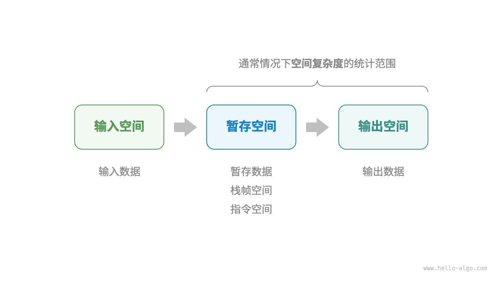

## 2.4 空间复杂度 💾

---

### 📜 空间复杂度定义

用于衡量算法占用内存空间随数据量变大的增长趋势，计算范围通常是暂存空间与输出空间之和。

---

### 📌  算法相关空间

- **输入空间**：存储算法输入数据。
- **暂存空间**：存放算法运行时的变量、对象等，可细分为暂存数据、栈帧空间、指令空间（实际统计常忽略）。
- **输出空间**：保存算法输出数据。



```cpp
/* 结构体 */
struct Node {
    int val;
    Node *next;
    Node(int x) : val(x), next(nullptr) {}
};

/* 函数 */
int func() {
    // 执行某些操作...
    return 0;
}

int algorithm(int n) {        // 输入数据
    const int a = 0;          // 暂存数据（常量）
    int b = 0;                // 暂存数据（变量）
    Node* node = new Node(0); // 暂存数据（对象）
    int c = func();           // 栈帧空间（调用函数）
    return a + b + c;         // 输出数据
}
```

---

### 📌  推算方法

与时间复杂度类似，将统计对象换为使用空间大小，一般只关注最差空间复杂度，“**最差**”体现在以**最差输入数据**和**算法运行中的峰值**内存为准。

```cpp
void algorithm(int n) {
    int a = 0;               // O(1)
    vector<int> b(10000);    // O(1)
    if (n > 10)
        vector<int> nums(n); // O(n)
}
```

**在递归函数中，需要注意统计栈帧空间**

```cpp
int func() {
    // 执行某些操作
    return 0;
}
/* 循环的空间复杂度为 O(1) */
void loop(int n) {
    for (int i = 0; i < n; i++) {
        func();
    }
}
/* 递归的空间复杂度为 O(n) */
void recur(int n) {
    if (n == 1) return;
    return recur(n - 1);
}
```

1. **常见类型**：按从低到高排列，包括常数阶、对数阶、线性阶、平方阶、指数阶。

   

   - 常数阶与输入数据大小无关；（在循环中初始化变量或调用函数而占用的内存，在进入下一循环后就会被释放）

     ```cpp
     /* 函数 */
     int func() {
         // 执行某些操作
         return 0;
     }

     /* 常数阶 */
     void constant(int n) {
         // 常量、变量、对象占用 O(1) 空间
         const int a = 0;
         int b = 0;
         vector<int> nums(10000);
         ListNode node(0);
         // 循环中的变量占用 O(1) 空间
         for (int i = 0; i < n; i++) {
             int c = 0;
         }
         // 循环中的函数占用 O(1) 空间
         for (int i = 0; i < n; i++) {
             func();
         }
     }
     ```

   - 线性阶的元素数量与输入数据大小成正比：
     ```cpp
     /* 线性阶 */
     void linear(int n) {
         // 长度为 n 的数组占用 O(n) 空间
         vector<int> nums(n);
         // 长度为 n 的列表占用 O(n) 空间
         vector<ListNode> nodes;
         for (int i = 0; i < n; i++) {
             nodes.push_back(ListNode(i));
         }
         // 长度为 n 的哈希表占用 O(n) 空间
         unordered_map<int, string> map;
         for (int i = 0; i < n; i++) {
             map[i] = to_string(i);
         }
     }
     ```
     ```cpp
     /* 线性阶（递归实现） */
     void linearRecur(int n) {
         cout << "递归 n = " << n << endl;
         if (n == 1)
             return;
         linearRecur(n - 1);
     }
     ```
     
   - 平方阶常见于矩阵和图：
     ```cpp
     /* 平方阶（递归实现） */
     int quadraticRecur(int n) {
         if (n <= 0)
             return 0;
         vector<int> nums(n);
         cout << "递归 n = " << n << " 中的 nums 长度 = " << nums.size() << endl;
         return quadraticRecur(n - 1);
     }
     ```
     
   - 指数阶常见于二叉树：
     ```cpp
     /* 指数阶（建立满二叉树） */
     TreeNode *buildTree(int n) {
         if (n == 0)
             return nullptr;
         TreeNode *root = new TreeNode(0);
         root->left = buildTree(n - 1);
         root->right = buildTree(n - 1);
         return root;
     }
     ```
     
   - 对数阶常见于分治算法

---

### **权衡时间与空间**

理想是时间和空间复杂度都最优，但实际很难做到。降低时间复杂度常以提升空间复杂度为代价，反之亦然。“以空间换时间”更常用，但数据量很大时，控制空间复杂度也很重要。
