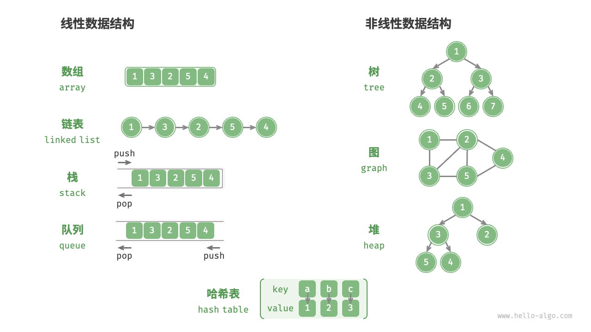
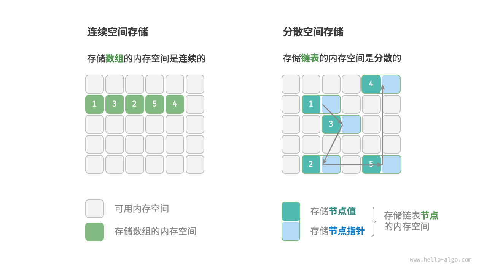

## 3.1 数据结构分类

1. **逻辑结构**：体现数据元素间逻辑关系，分为线性和非线性结构。

   线性结构数据呈线性排列，包括数组、链表、栈、队列、哈希表，元素间是一对一顺序关系；非线性结构数据排列非线性，又分为树形结构和网状结构。树形结构如树、堆、哈希表，元素间一对多；网状结构即图，元素间多对多。

   

2. **物理结构**：反映数据在计算机内存的存储方式，有连续空间存储（数组）和分散空间存储（链表）两种。所有数据结构基于数组、链表或二者组合实现，不同物理结构决定数据操作方法，在时间和空间效率上互补。数组初始化后长度一般不变（也可重新分配内存变“动态”），链表长度在程序运行时可调整。

   
