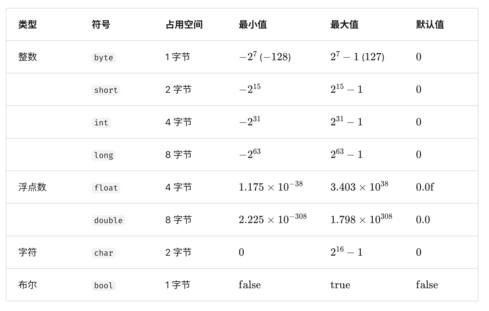

## 基本数据类型

主要围绕计算机中的基本数据类型展开，介绍了其种类、存储方式、在不同编程语言中的特点，以及与数据结构的关系。

1. **基本数据类型概述**：计算机数据形式多样，均由基本数据类型构成。基本数据类型是 CPU 可直接运算、算法中直接使用的类型，包括整数、浮点数、字符、布尔类型。

   

2. **存储方式**：基本数据类型以二进制形式存储，二进制位即比特，字节由比特组成。其取值范围取决于占用空间大小，如 Java 中 byte 占用 1 字节（8 比特 ），int 占用 4 字节（32 比特 ）。
3. **不同编程语言中的差异**：不同编程语言对基本数据类型的定义不同。Python 中整数大小受限内存，浮点数为双精度 64 位，无 char 类型；C 和 C++未明确规定基本数据类型大小，因实现和平台而异。
4. **与数据结构的关系**：基本数据类型决定数据“内容类型”，数据结构决定数据“组织方式”。如数组可存储不同基本数据类型的数据，文中用多种编程语言示例展示了用数组存储不同基本数据类型的情况。
