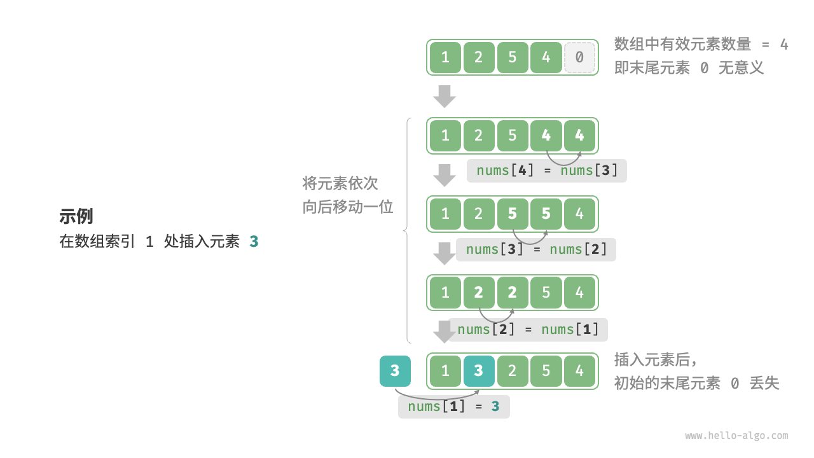

数组（array）是一种线性数据结构，其将相同类型的元素存储在连续的内存空间中。我们将元素在数组中的位置称为该元素的索引（index）。


- 数组常用操作

  - **初始化**：有指定和不指定初始值两种方式，不同编程语言的初始化语法各异。
    ```cpp
    /* 初始化数组 */
    // 存储在栈上
    int arr[5]; //会有垃圾值
    int nums[5] = { 1, 3, 2, 5, 4 };
    // 存储在堆上（需要手动释放空间）
    int* arr1 = new int[5];//一般来说为 0
    int* nums1 = new int[5] { 1, 3, 2, 5, 4 };
    ```
  - **访问元素**：能依据索引在 O(1)时间内随机访问，计算内存地址即可获取元素。
    
    ```cpp
    /* 随机访问元素 */
    int randomAccess(int *nums, int size) {
        // 在区间 [0, size) 中随机抽取一个数字
        int randomIndex = rand() % size;
        // 获取并返回随机元素
        int randomNum = nums[randomIndex];
        return randomNum;
    }
    ```
  - **插入元素**：在数组中间插入元素，需将该索引后的元素依次后移，时间复杂度 O(n)，且可能导致尾部元素丢失。
    
    ```cpp
    void insert(int *nums, int size, int num, int index){
    	for (int i = size-1; i>index; i--){
    		num[i]=num[i-1];
    	}
    	num[index]=num;
    }
    ```
  - **删除元素**：删除指定索引元素时，其后元素要依次前移，平均时间复杂度 O(n) ，末尾元素会变得无意义。
    

    ```cpp
    void delete(int *nums, int size, int index){
    	for(int i = index; i<size-1; i++ ){
    		num[i]=num[i+1]
    	}

    }
    ```

  - **遍历数组**：可通过索引遍历，也能直接遍历元素，部分语言还支持同时遍历索引和元素。
    ```cpp
    /* 遍历数组 */
    void traverse(int *nums, int size) {
        int count = 0;
        // 通过索引遍历数组
        for (int i = 0; i < size; i++) {
            count += nums[i];
        }
    }
    ```
  - **查找元素**：采用线性查找，遍历数组对比元素值，匹配则返回索引，否则返回 -1。
    ```cpp
    int find(int *nums, int size, int num){
    	for (int i=0; i<size; i++){
    		if(num[i]==num)
    			return i;
    	}
    	return -1;
    }
    ```
  - **扩容数组**：多数语言中数组长度不可变，扩容需新建大数组并复制原数组元素，时间复杂度 O(n)。
    ```cpp
    int *extend(int *nums, int size, int enlarge){
    	int *res = new int[size+enlarge];
    	for (int i=0; i<size;i++){
    		res[i]=nums[i];
    	}
    	delete[] nums;
    	return res;
    }
    ```

- **优点与局限性**：优点是空间效率高、支持随机访问、有缓存局部性；局限在于插入删除效率低、长度不可变、可能造成空间浪费。
- **典型应用**：常用于随机访问场景，也是排序、搜索算法的常用数据结构；可作为查找表；在机器学习中用于构建向量、矩阵等；还能实现栈、队列等多种数据结构。
