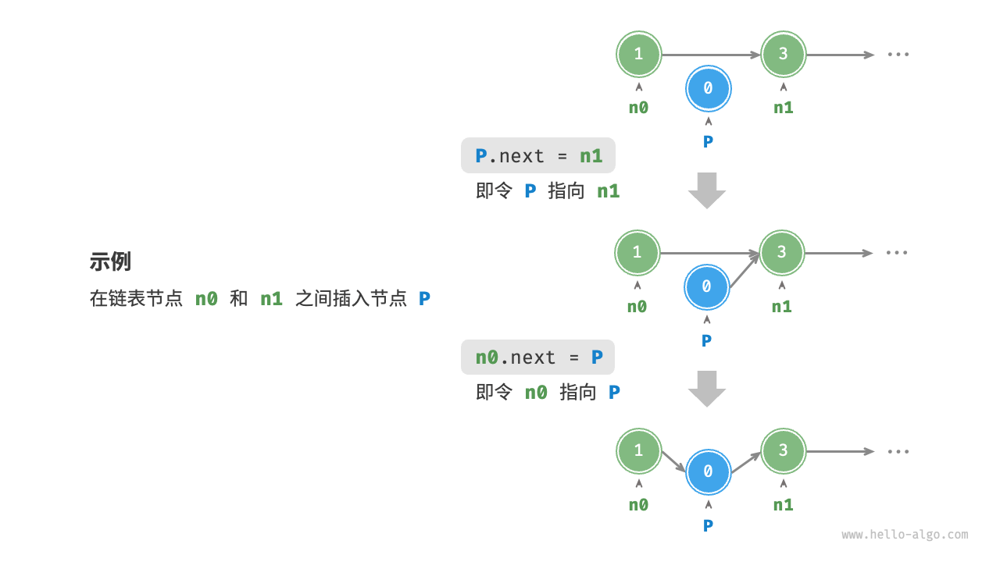
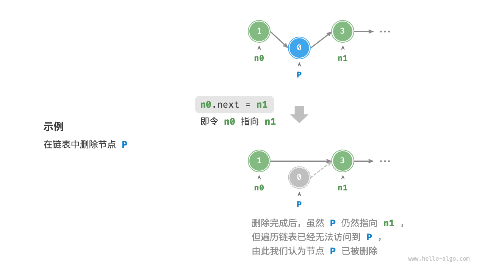
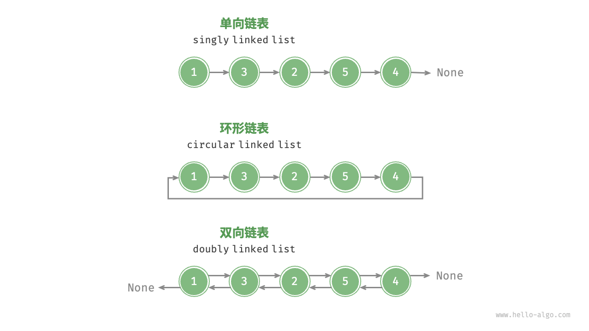

- **链表基础**
  - **定义与结构**：链表是线性数据结构，由节点构成，节点含值和指向下一节点的引用（或指针），节点可分散存储。链表有头节点和尾节点，尾节点指向空。
    ```cpp
    struct ListNode{
    	int val;
    	ListNode *next;
    	ListNode(int x): val(x), next(bullptr){}
    };
    ```
- 链表常用操作
  - **初始化**：先初始化各节点对象，再构建节点间引用关系，通常用头节点代表链表。
    ```cpp
    /* 初始化链表 1 -> 3 -> 2 -> 5 -> 4 */
    // 初始化各个节点
    ListNode* n0 = new ListNode(1);
    ListNode* n1 = new ListNode(3);
    ListNode* n2 = new ListNode(2);
    ListNode* n3 = new ListNode(5);
    ListNode* n4 = new ListNode(4);
    // 构建节点之间的引用
    n0->next = n1;
    n1->next = n2;
    n2->next = n3;
    n3->next = n4;
    ```
  - **插入节点**：在链表中插入节点，改变两个节点引用即可，时间复杂度为$O(1)$ ，比数组插入效率高。
    
    ```cpp
    /* 在链表的节点 n0 之后插入节点 P */
    void insert(ListNode *n0, ListNode *P) {
        ListNode *n1 = n0->next;
        P->next = n1;
        n0->next = P;
    }
    ```
  - **删除节点**：删除链表节点，改变一个节点引用即可，删除后原节点不再属于链表。
    
    ```cpp
    /* 删除链表的节点 n0 之后的首个节点 */
    void remove(ListNode *n0) {
        if (n0->next == nullptr)
            return;
        // n0 -> P -> n1
        ListNode *P = n0->next;
        ListNode *n1 = P->next;
        n0->next = n1;
        // 释放内存
        delete P;
    }
    ```
  - **访问节点**：链表访问节点需从头节点遍历，访问第$i$个节点时间复杂度为$O(n)$，效率低于数组。
    ```cpp
    /* 访问链表中索引为 index 的节点 */
    ListNode *access(ListNode *head, int index) {
        for (int i = 0; i < index; i++) {
            if (head == nullptr)
                return nullptr;
            head = head->next;
        }
        return head;
    }
    ```
  - **查找节点**：遍历链表查找值为 target 的节点，返回索引，属于线性查找。
    ```cpp
    /* 在链表中查找值为 target 的首个节点 */
    int find(ListNode *head, int target) {
        int index = 0;
        while (head != nullptr) {
            if (head->val == target)
                return index;
            head = head->next;
            index++;
        }
        return -1;
    }
    ```
- **数组与链表对比**：数组内存连续，链表内存不连续。数组随机访问快，插入删除慢；链表插入删除快，随机访问慢。链表比数组占用更多内存。
- **常见链表类型**
  - **单向链表**：普通链表，节点含值和指向下一节点的引用，尾节点指向空。
  - **环形链表**：单向链表尾节点指向头节点，任意节点可当头节点。
  - **双向链表**：节点含指向后继和前驱节点的引用，更灵活，但占用更多内存。
    
    ```cpp
    /* 双向链表节点结构体 */
    struct ListNode {
        int val;         // 节点值
        ListNode *next;  // 指向后继节点的指针
        ListNode *prev;  // 指向前驱节点的指针
        ListNode(int x) : val(x), next(nullptr), prev(nullptr) {}  // 构造函数
    };
    ```
- **链表应用场景**
  - **单向链表**：用于实现栈、队列、哈希表和图等数据结构。
  - **双向链表**：适用于需快速查找前后元素的场景，如浏览器历史记录、LRU 算法等。
  - **环形链表**：用于周期性操作场景，如操作系统资源调度、数据缓冲区等。
